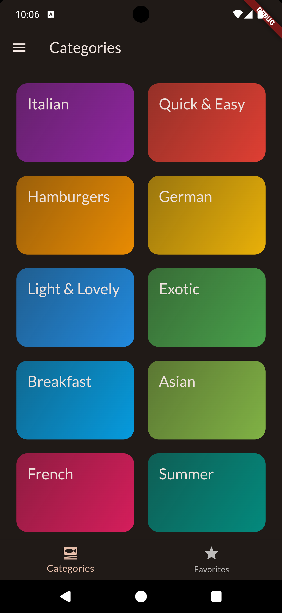

# Meals App

Meals App is a Flutter application that displays a list of dummy meals. Users can filter meals by
their type and add meals to their favorites. The application uses Riverpod for state management.

## Screenshots

  
  
  
  
  

## Features

* **List of Meals:** Browse through a list of dummy meals.
* **Filter Meals:** Filter meals by type (e.g., vegetarian, vegan, gluten-free).
* **Favorites:** Add or remove meals from your favorites list.
* **State Management:** Managed using Riverpod for efficient state handling.

## Usage

### Home Screen

* Displays a list of categories.
* Tap on a category to view its meals.

### Meals Screen

* Displays a list of all category meals.
* Tap on a meal to view its details.

### Meal Details

* Shows ingredients and recipe of the selected meal.
* Add the meal to your favorites by tapping the favorite icon on app bar.

### Favourites

* View all meals that have been added to your favorites.
* Remove meals from favorites by tapping the favorite icon again.

### Filters

* Apply filters to the meal list by selecting the desired meal types.
* Filter options include vegetarian, vegan, gluten-free, and more.

## State Management with Riverpod

This application uses Riverpod for state management. Riverpod provides a robust and scalable way to
manage state in Flutter applications. For more information on Riverpod, visit [the official
documentation.](https://riverpod.dev/)
